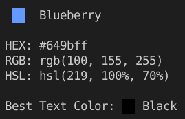
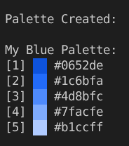
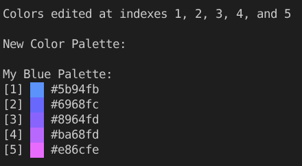
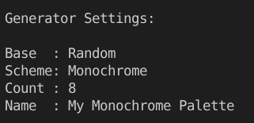
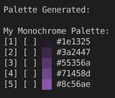
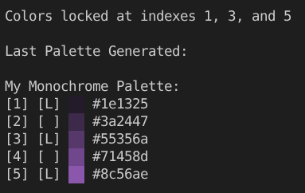

# KColor
KColor is a command-line tool for creating, managing, and generating color palettes made in Python.

### Features
 - Supports **HEX**, **RGB**, **HSL**, and **CMYK** input formats
 - Locally converts colors between formats
 - **Palette Generation** with:
   - Color schemes
   - Locking/unlocking specific colors
   - Random colors
 - Saving and loading palettes
 - **Colored previews** of generated colors

## Instalation
### From [TestPyPi](https://test.pypi.org/project/kcolor/0.0.1/)
```
pip install -i https://test.pypi.org/simple/ kcolor
```
### From source
```
git clone https://github.com/ConstintCreations/KColor.git
cd KColor
pip install -e .
```

## Usage
```
kcolor <command> [options]
```
### Main Commands
 - `info`: Shows info about a color
 - `palette`: Manages color palettes
 - `generator`: Generates color palettes
---
### Supported Color Formats
| Format | Examples |
| ----------- | ---------- |
| HEX | `"#649bff"`, `649bff` |
| RGB | `"rgb(100,155,255)"`, `100,155,255` |
| HSL | `"hsl(219,100%,70%)"`, `219,100%,70%` |
| CMYK | `"cmyk(61,39,0,0)"`, `61,39,0,0` |

It is not necessary to include the `#`, `rgb()`, `hsl()`, or `cmyk()`<br>
If they are included, quotes must be used

---
### `info` Command
Shows info about a color

`kcolor info [color]`

**Example:**

`kcolor info 649bff`

Output:



**Flags:**

`-f`, `--full`: Shows additional color information, like less common color formats

---
### `palette` Commands
### Create a palette

Palette creation creates a palette with a specified name containing the specified colors

`kcolor palette create [name] [colors]`

**Example:**

`kcolor palette create "My Blue Palette" 0652de 1c6bfa 4d8bfc 7facfe b1ccff`

Output:



---
### Show palettes

`kcolor palette show`: Shows all palettes <br>
`kcolor palette show [name]`: Shows a specific palette

---
### Edit a palette

Palette editing supports adding, setting (changing), and removing colors and supports multiple colors at once

`kolor palette edit [name] (--add | --set | --remove)` 

---

**Add colors**

Adds the specified colors to the specified palette

`kcolor palette edit [name] --add [colors]`: 

---

**Remove colors**

Removes the colors at the specified indexes from the specified palette

`kcolor palette edit [name] --add [indexes]`

---

**Set colors**

Uses index and color pairs to change colors at the specified indexes on the specified palette

`kcolor palette edit [name] --set [index:color]`

**Example:**

`kcolor palette edit  --set 1:5b94fb 2:6968fc 3:8964fd 4:ba68fd 5:e86cfe`

Output:



---

### Delete a palette

Deletes a specified palette

`kcolor palette delete [name]`

---

### Clear all palettes

`kcolor palette clear`: Deletes all palettes, prompting for confirmation<br>
`kcolor palette clear --confirm`: Deletes all palettes without prompting for confirmation

---

### `generator` Commands
### Change generator settings

The generator has a base color, color scheme, color count, and palette name setting

This can be shown with `kcolor generator settings` or changed with:

`kcolor generator settings --base ["random" or color] --scheme ["random" or scheme] --count [2-1000] --name [name]`

Note that you can change as many or as little of these settings as you'd like in one command

**Example:**

`kcolor generator settings --base random --scheme monochrome --count 8 --name "My Monochrome Palette"`

Output:



---
**Available Schemes**
 - `random` (picks from one of the other schemes, excluding triad and quad)
 - `monochrome`
 - `monochrome-dark`
 - `monochrome-light`
 - `analogic`
 - `complement`
 - `analogic-complement`
 - `triad` (count must be 3 and will automatically be set to 3)
 - `quad` (count must be 4 and will automatically be set to 4)
---

### Generate a palette

Palettes can be generated with generate and settings can be overriden for a single generation

`kcolor generator generate`: Generates a color palette with saved settings <br>
`kcolor generator generate --base ["random" or color] --scheme ["random" or scheme] --count [2-1000]`: Generates a color palette, temporarily overriding the base, scheme, and count settings

**Example:**

`kcolor generator generate --count 5`

Output:



--- 

### Show the last generated palette

Shows the last palette that was generated by the generator

`kcolor generator show`

---

### Lock and unlock colors

Locks and unlocks colors in the generator

`kcolor generator lock [indexes]`: Locks colors at the specified indexes so they don't change in new generations <br>
`kcolor generator unlock [indexes]`: Unlocks colors at the specified indexes so they do change in new generations

**Example:**

`kcolor generator lock 1 3 5`

Output:



---
### Saving and loading palettes

**Saving generated palettes**

`kcolor generator save`: Saves a generated palette to your palettes under the name in the generator settings<br>
`kcolor generator save [name]`: Saves a generated palette to you palettes under the specified name

Note that saving palettes through the generator will overwrite existing palettes with that name 

---
**Loading palettes to the generator**

Loads a palette to the generator with the specified name

`kcolor generator load [name]`

---
